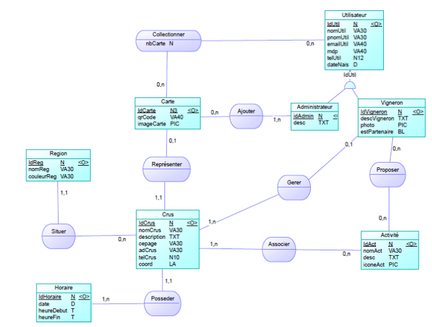

<h1>Age Of Champagne</h1>
Liste Membre (Membre | Identifiant) du projet :
<ul>
	<li>Boscher Killian | bosc0005</li>
	<li>Delloque Mael | dell0014</li>
	<li>Jacquin Alexis | jacq0203</li>
	<li>Samina Angelo | sami0002</li>
	<li>Schoeny Luc | scho0029</li>
</ul>
<h2>Sommaire</h2>
<ol>
	<li>Description du projet</li>
	<li>Informations Importantes</li>
	<li>Scripts Composer | Fichier de configuration</li>
</ol>
<h2>1 - Description du projet</h2>
Ce projet à pour but la réalisation d'une application web pour le jeu de carte Age Of Champagne. Celle-ci sera réalisé avec <a href="https://symfony.com/what-is-symfony">Symfony</a> (Version 5.4). Age of Champagne est un jeu de cartes dont la sortie est prévue
pour cette année (2022). Ce jeu d’origine Française a pour but la
mise en avant d’une de nos spécialités connues dans le monde
entier, la Champagne. 
 
L'application devra posséder les fonctionnalités suivantes :
<ol>
	<li> [ ] Stockage des cartes dans une collection virtuelle</li>
	<li> [ ] Localisation des maisons de champagnes(GPS)</li>
	<li> [ ] Lister les avantages dsisponibles aupres des maisons de champagnes (promotion)</li>
</ol>
<h2>2 - Informations Importantes</h2>
Ci dessous le MCD de la base de donnée 

<h2>Scripts Composer | fichier de configuration</h2>
Les scripts ajouté dans le composer.json seront listés ci-dessous... 
Liste et utilité des scripts Composer :
<dl>
	<dt>Nom script | commande utilisé<dt>
		<dd>utilité de la commande</dd>
</dl>
